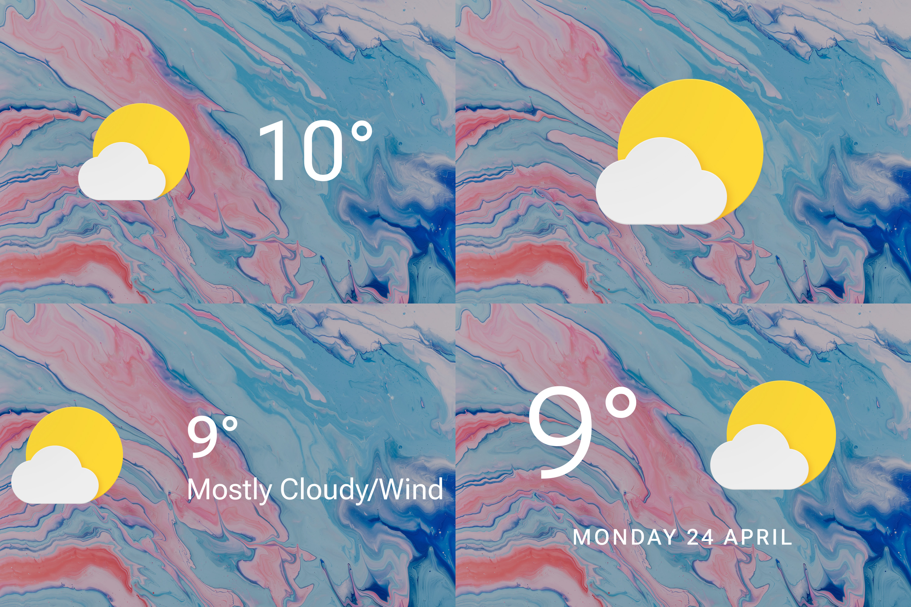

# JDWS-01

JDWS – Jelle Dekkers' Weather Skins – is a collection of weather skins. Each release comes with four skins. Combining them like this saves me a lot of time and hassle whenever I want to update something.

To change any of the settings, right-click the skin. "Global settings..." is for settings that affect all of the skins in that release, such as the weather location, units or language. "Config settings..." features various options for that specific skin, such as the size or alignment.
